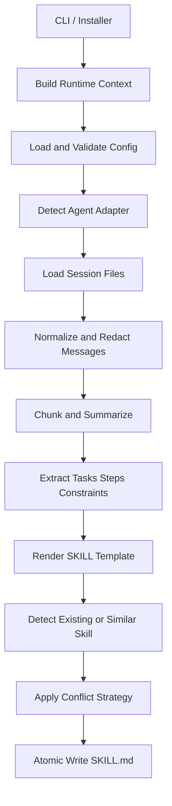

# Technical Design

> [中文](TECHNICAL_DESIGN_CN.md)

### Architecture goals

`Experience-to-Skill Generator` upgrades a focused OpenClaw session analyzer into a universal agent SKILL generator. The core principles are:

- **Generic by default**: no hard dependency on one agent layout or command.
- **Configurable**: defaults, config files, environment variables, and CLI flags can override behavior.
- **Safe defaults**: redaction is enabled, raw preservation is disabled, and writes avoid damaging existing files.
- **Script-friendly**: core commands provide JSON output and non-zero exit codes for errors.
- **Extensible**: adapters and templates support new agents and output styles.

### Core modules

Most implementation lives in `python-scripts/universal_skill_generator.py`, with supporting modules:

| Module | File | Responsibility |
| --- | --- | --- |
| Config loading | `universal_skill_generator.py` | Merge defaults, JSON config, environment variables, and CLI overrides |
| Config validation | `universal_skill_generator.py` | Validate agent, session sources, output, analysis, security, templates, and adapters |
| Agent adapters | `universal_skill_generator.py` | Detect `openclaw` or fall back to `generic`; allow custom adapters |
| Session loading | `universal_skill_generator.py` | Read files or directories in `json`, `jsonl`, `md`, or `txt` format |
| Preprocessing | `universal_skill_generator.py` | Validate empty data, normalize roles, chunk long sessions, truncate max chars |
| Redaction | `universal_skill_generator.py` | Clean tokens, secrets, emails, private paths, logs, and generated results |
| Analysis | `analyze_conversation.py` | Extract tasks, steps, constraints, keywords, confidence, and review flags |
| SKILL rendering | `generate_skill.py` | Generate structured `SKILL.md` and metadata from analysis results |
| Vector engine | `vector_skill_optimizer.py` | Skill vectorization, similarity search, and gap analysis (numpy optional, pure-Python fallback) |
| Writing | `universal_skill_generator.py` | Atomic writes, similar skill detection, and conflict strategy handling |
| CLI | `universal_skill_generator.py` | `diagnose`, `analyze`, `generate`, `config`, `validate-config` |

### Data flow



### Configuration merge order

Configuration precedence (low to high):

1. `DEFAULT_CONFIG`
2. JSON file specified by `--config`
3. Environment variable overrides, e.g. `ESG_OUTPUT_DIR`, `ESG_SESSION_DIR`
4. CLI flag overrides, e.g. `--input`, `--output-dir`, `--conflict`

This design ensures sensible defaults while allowing installers and automation pipelines to override as needed.

### Agent adapter strategy

Built-in adapters:

| Adapter | session_dir | skill_dir | metadata_format |
| --- | --- | --- | --- |
| `openclaw` | `~/.openclaw/agents` | `~/.openclaw/skills` | `openclaw` |
| `generic` | `./sessions` | `./generated_skills` | `generic` |

`--agent auto` detects OpenClaw markers or the `openclaw` command first; otherwise it falls back to `generic`.

Custom adapters can be added via the `adapters` config:

```json
{
  "adapters": {
    "custom-agent": {
      "skill_dir": "~/.custom-agent/skills",
      "config_dir": "~/.custom-agent/config/experience-to-skill-generator",
      "session_dir": "~/.custom-agent/sessions",
      "metadata_format": "generic"
    }
  }
}
```

### Session analysis strategy

The current implementation uses lightweight rule-based analysis without external models:

- Extracts task sentences from user messages using markers like "please, need, help me, implement, fix, analyze, generate".
- Extracts numbered lists, bullet points, and step-like sentences from assistant messages.
- Extracts constraint sentences using markers like "must, must not, caution, only, avoid".
- Extracts keywords using English and Chinese morphological rules.
- Computes confidence based on message count, tasks, steps, and role coverage.

When `confidence` falls below `analysis.confidence_threshold`, the generated document flags the need for human review.

### Templates and metadata

Supported templates:

| Template | Description |
| --- | --- |
| `standard` | Default template with full sections |
| `compact` | Concise template for quick internal capture |
| `checklist` | Checklist template for execution-oriented flows |

Supported metadata formats:

| Format | Behavior |
| --- | --- |
| `generic` | Stores JSON metadata in HTML comments |
| `openclaw` | Stores metadata in YAML-like front matter |
| `json` | Outputs a JSON metadata block |

### Writing and conflict handling

Write flow:

1. Resolve target directory.
2. Check for same-name `SKILL.md`.
3. Check for similar skill directory names (default similarity threshold `0.8`).
4. Apply conflict strategy.
5. Write to a temporary file.
6. Atomically replace the final `SKILL.md`.

Conflict strategies:

- `rename`: writes to a new directory.
- `skip`: returns the existing path without writing.
- `overwrite`: creates `.bak` backup first.
- `merge`: appends new analysis results.
- `fail`: raises a user-readable error and returns a non-zero exit code.

### Installer design

`skills/experience-to-skill-generator/install.sh` is responsible for:

- Checking Python 3.8+.
- Checking optional dependencies `numpy` and `sklearn`.
- Auto-detecting OpenClaw or falling back to generic install.
- Copying the skill package and config files.
- Creating an `experience-to-skill-generator` command entry in `ESG_BIN_DIR`.
- Optionally running `openclaw skills install/update`.
- Creating sample session data.
- Cleaning up temporary files on install failure.

### Validation strategy

- **Unit tests**: `python3 -m unittest python-scripts/test_universal_skill_generator.py`
- **End-to-end validation**: `python3 python-scripts/e2e_validate_universal_skill_generator.py`
- **Compile check**: `python3 -m py_compile python-scripts/universal_skill_generator.py`

E2E validation covers:

- `generic` agent flow.
- `openclaw` agent flow.
- `diagnose`, `analyze`, `generate` commands.
- Required sections and metadata in generated documents.

### Vector engine design

`python-scripts/vector_skill_optimizer.py` provides optional vector-based skill similarity and gap analysis:

- **Skill vectorization**: converts skill text into a 12-dimension feature vector covering categories such as language, domain, complexity, and automation level.
- **Similarity search**: finds existing skills similar to a query using cosine similarity (dot product of normalized vectors).
- **Gap analysis**: identifies weak dimensions in a skill and suggests improvements or innovative combinations.
- **Numpy optional**: all vector operations have pure-Python fallbacks; `numpy` accelerates computation when available but is not required.
- **Persistence**: skill vectors and metadata can be saved to / loaded from JSON files.