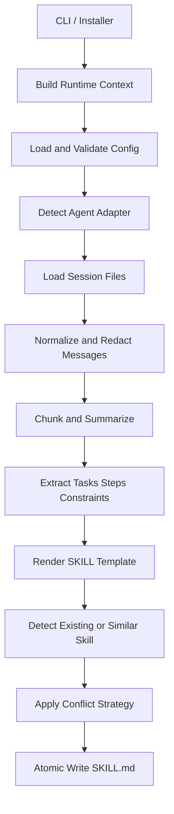

# Technical Design

> [中文](TECHNICAL_DESIGN_CN.md)

### 1. Architecture goals

`Experience-to-Skill Generator` upgrades a focused OpenClaw session analyzer into a universal agent SKILL generator. The core principles are:

- **Generic by default**: no hard dependency on one agent layout or command.
- **Configurable**: defaults, config files, environment variables, and CLI flags can override behavior.
- **Safe defaults**: redaction is enabled, raw preservation is disabled, and writes avoid damaging existing files.
- **Script-friendly**: core commands provide JSON output and non-zero exit codes for errors.
- **Extensible**: adapters and templates support new agents and output styles.

### 2. Data flow



### 3. Agent adapter strategy

Built-in adapters (must match `KNOWN_AGENT_ADAPTERS` in [universal_skill_generator.py](../python-scripts/universal_skill_generator.py)):

| Adapter | `markers` | `skill_dir` | `config_dir` | `session_dir` | `metadata_format` |
| --- | --- | --- | --- | --- | --- |
| `openclaw` | `[".openclaw"]` | `~/.openclaw/skills` | `~/.openclaw/config/skills/experience-to-skill-generator` | `~/.openclaw/agents` | `openclaw` |
| `generic` | `[]` | `./generated_skills` | `./.experience-to-skill-generator` | `./sessions` | `generic` |

The `auto` strategy detects OpenClaw markers or the `openclaw` command first; otherwise it falls back to `generic`. No manual selection needed.

Custom adapters can be added via the `adapters` config:

```json
{
  "adapters": {
    "custom-agent": {
      "skill_dir": "~/.custom-agent/skills",
      "config_dir": "~/.custom-agent/config/experience-to-skill-generator",
      "session_dir": "~/.custom-agent/sessions",
      "metadata_format": "generic"
    }
  }
}
```

### 4. Session analysis strategy

The current implementation uses lightweight rule-based analysis without external models:

- Extracts task sentences from user messages using markers like "please, need, help me, implement, fix, analyze, generate".
- Extracts numbered lists, bullet points, and step-like sentences from assistant messages.
- Extracts constraint sentences using markers like "must, must not, caution, only, avoid".
- Extracts keywords using English and Chinese morphological rules.
- Computes confidence based on message count, tasks, steps, and role coverage.

When `confidence` falls below `analysis.confidence_threshold`, the generated document flags the need for human review.

### 5. Templates and metadata

Supported templates:

| Template | Description |
| --- | --- |
| `standard` | Default template with full sections |
| `compact` | Concise template for quick internal capture |
| `checklist` | Checklist template for execution-oriented flows |

Supported metadata formats:

| Format | Behavior |
| --- | --- |
| `generic` | Stores JSON metadata in HTML comments |
| `openclaw` | Stores metadata in YAML-like front matter |
| `json` | Outputs a JSON metadata block |

### 6. Writing and conflict handling

Write flow:

1. Resolve target directory.
2. Check for same-name `SKILL.md`.
3. Check for similar skill directory names (default similarity threshold `0.8`).
4. Apply conflict strategy.
5. Write to a temporary file.
6. Atomically replace the final `SKILL.md`.

Conflict strategies:

- `rename`: writes to a new directory.
- `skip`: returns the existing path without writing.
- `overwrite`: creates `.bak` backup first.
- `merge`: appends new analysis results.
- `fail`: raises a user-readable error and returns a non-zero exit code.

### 7. Installer design

`skills/experience-to-skill-generator/install.sh` is responsible for:

- Checking Python 3.8+.
- Checking optional dependencies `numpy` and `sklearn`.
- Auto-detecting OpenClaw or falling back to generic install.
- Copying the skill package and config files.
- Creating an `experience-to-skill-generator` command entry in `ESG_BIN_DIR`.
- Optionally running `openclaw skills install/update`.
- Creating sample session data.
- Cleaning up temporary files on install failure.

#### 7.1 Command entry script internals

The installer generates a **thin Shell wrapper script** (not a compiled binary) as the CLI command entry point using Here Document syntax:

```bash
cat > "$cli_path" <<EOF
#!/usr/bin/env bash
exec "$PYTHON_BIN" "$PROJECT_DIR/python-scripts/universal_skill_generator.py" "\$@"
EOF
chmod +x "$cli_path"
```

Key elements:

| Element | Explanation |
| --- | --- |
| `cat > ... <<EOF` | Shell Here Document syntax — writes multi-line text into the target file |
| `#!/usr/bin/env bash` | Shebang line declaring the script should be executed with bash |
| `exec` | **Replaces** the current shell process with the Python process, avoiding an extra parent process |
| `"$PYTHON_BIN"` / `"$PROJECT_DIR/..."` | Expanded to absolute paths at install time and hard-coded into the script |
| `"\$@"` | The `$` is escaped during generation; at runtime it becomes `"$@"`, forwarding all user arguments |
| `chmod +x` | Grants execute permission |

Example of the generated file:

```bash
#!/usr/bin/env bash
exec "/usr/bin/python3" "/home/user/experience-to-skill-generator/python-scripts/universal_skill_generator.py" "$@"
```

Characteristics of this approach:

- **Not** a compiled/packaged binary (unlike PyInstaller or similar tools) — no build step required.
- **Is** a thin shell script acting as a "shortcut" — changes to the `.py` source take effect immediately.
- Depends on a Python interpreter already installed on the system.

### 8. Validation strategy

- **Unit tests**: `python3 -m unittest python-scripts/test_universal_skill_generator.py`
- **End-to-end validation**: `python3 python-scripts/e2e_validate_universal_skill_generator.py`
- **Compile check**: `python3 -m py_compile python-scripts/universal_skill_generator.py`

E2E validation covers:

- `generic` agent flow.
- `openclaw` agent flow.
- `diagnose`, `analyze`, `generate` commands.
- Required sections and metadata in generated documents.

### 9. Module layout

`python-scripts/` contains exactly three files:

| File | Role |
| --- | --- |
| `universal_skill_generator.py` | Main CLI entry; implements all 5 subcommands (`analyze` / `generate` / `diagnose` / `config` / `validate-config`), config merging, adapter detection, session analysis, template rendering, and atomic writes |
| `test_universal_skill_generator.py` | Unit tests for the main CLI |
| `e2e_validate_universal_skill_generator.py` | End-to-end validation covering both `generic` and `openclaw` adapter flows |