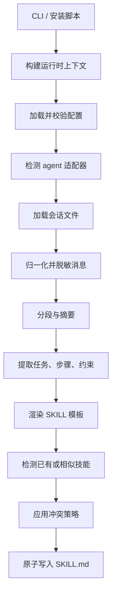

# 技术设计

> [English](TECHNICAL_DESIGN.md)

### 架构目标

`Experience-to-Skill Generator` 的目标是把特定 OpenClaw 会话分析能力升级为通用 agent 技能生成能力。核心设计原则：

- **通用性**：不依赖单一 agent 的目录结构或命令。
- **可配置**：默认配置、配置文件、环境变量和 CLI 参数均可覆盖行为。
- **安全默认值**：默认脱敏，默认不保留原文，写入时避免破坏已有文件。
- **脚本友好**：所有核心命令输出 JSON 或稳定文本，错误返回非零退出码。
- **可扩展**：通过 adapter 和模板配置扩展新的 agent 与输出格式。

### 核心模块

主要实现集中在 `python-scripts/universal_skill_generator.py`，辅助模块如下：

| 模块 | 文件 | 关键职责 |
| --- | --- | --- |
| 配置加载 | `universal_skill_generator.py` | 合并默认配置、JSON 配置、环境变量和 CLI 覆盖 |
| 配置校验 | `universal_skill_generator.py` | 校验 agent、session_sources、output、analysis、security、templates、adapters |
| agent 适配 | `universal_skill_generator.py` | 识别 `openclaw` 或回退到 `generic`，支持自定义 adapter |
| 会话读取 | `universal_skill_generator.py` | 读取文件或目录，支持 `json`、`jsonl`、`md`、`txt` |
| 预处理 | `universal_skill_generator.py` | 空数据校验、角色归一化、长会话分段、最大字符截断 |
| 脱敏 | `universal_skill_generator.py` | 清理令牌、密钥、邮箱、私有路径，并复用于日志和生成结果 |
| 分析 | `analyze_conversation.py` | 提取任务、步骤、约束、关键词、置信度和人工审核标记 |
| SKILL 生成 | `generate_skill.py` | 基于分析结果生成结构化 `SKILL.md` 和 metadata |
| 向量引擎 | `vector_skill_optimizer.py` | 技能向量化、相似度搜索、缺口分析（numpy 可选，支持纯 Python 降级） |
| 写入 | `universal_skill_generator.py` | 原子写入、相似技能检测、冲突策略处理 |
| CLI | `universal_skill_generator.py` | `diagnose`、`analyze`、`generate`、`config`、`validate-config` |

### 数据流



### 配置合并顺序

配置优先级由低到高：

1. `DEFAULT_CONFIG`
2. `--config` 指定的 JSON 文件
3. 环境变量覆盖，例如 `ESG_OUTPUT_DIR`、`ESG_SESSION_DIR`
4. CLI 参数覆盖，例如 `--input`、`--output-dir`、`--conflict`

这种设计保证默认可用，同时支持安装脚本和自动化流水线按需覆盖。

### Agent 适配策略

内置 adapter：

| Adapter | session_dir | skill_dir | metadata_format |
| --- | --- | --- | --- |
| `openclaw` | `~/.openclaw/agents` | `~/.openclaw/skills` | `openclaw` |
| `generic` | `./sessions` | `./generated_skills` | `generic` |

`--agent auto` 会优先检测 OpenClaw 标记或 `openclaw` 命令；否则回退到 `generic`。

可通过配置中的 `adapters` 扩展新 agent：

```json
{
  "adapters": {
    "custom-agent": {
      "skill_dir": "~/.custom-agent/skills",
      "config_dir": "~/.custom-agent/config/experience-to-skill-generator",
      "session_dir": "~/.custom-agent/sessions",
      "metadata_format": "generic"
    }
  }
}
```

### 会话分析策略

当前实现采用轻量规则分析，不依赖外部模型：

- 从用户消息中提取包含"请、需要、帮我、实现、修复、分析、生成"等标记的任务句。
- 从 assistant 消息中提取编号列表、项目符号和步骤性句子。
- 从全文中提取"必须、禁止、注意、只能、避免"等约束句。
- 使用中英文词形规则提取关键词。
- 根据消息数量、任务、步骤、角色覆盖计算置信度。

当 `confidence` 低于配置中的 `analysis.confidence_threshold` 时，生成文档会提示需要人工审核。

### 模板与元数据

支持的模板：

| 模板 | 说明 |
| --- | --- |
| `standard` | 默认模板，包含完整章节 |
| `compact` | 简洁模板，适合内部快速沉淀 |
| `checklist` | 清单模板，适合执行型流程 |

支持的 metadata 格式：

| 格式 | 行为 |
| --- | --- |
| `generic` | 使用 HTML 注释保存 JSON metadata |
| `openclaw` | 使用 YAML-like front matter 保存 metadata |
| `json` | 输出 JSON metadata 块 |

### 写入与冲突处理

写入流程：

1. 解析目标目录。
2. 检查同名 `SKILL.md`。
3. 检查相似技能目录名，默认相似阈值为 `0.8`。
4. 应用冲突策略。
5. 写入临时文件。
6. 原子替换最终 `SKILL.md`。

冲突策略：

- `rename`：写入新目录。
- `skip`：返回已有路径，不写入。
- `overwrite`：先创建 `.bak` 备份。
- `merge`：追加新分析结果。
- `fail`：抛出用户可读错误并返回非零退出码。

### 安装脚本设计

`skills/experience-to-skill-generator/install.sh` 负责：

- 检查 Python 3.8+。
- 检查可选依赖 `numpy`、`sklearn`。
- 自动识别 OpenClaw 或通用兼容安装策略。
- 复制技能包和配置文件。
- 在 `ESG_BIN_DIR` 下创建 `experience-to-skill-generator` 命令入口。
- 可选执行 `openclaw skills install/update`。
- 创建示例会话数据。
- 安装失败时清理本次创建的临时文件。

### 验证策略

- **单元测试**：`python3 -m unittest python-scripts/test_universal_skill_generator.py`
- **端到端验证**：`python3 python-scripts/e2e_validate_universal_skill_generator.py`
- **编译检查**：`python3 -m py_compile python-scripts/universal_skill_generator.py`

端到端验证覆盖：

- `generic` agent 流程。
- `openclaw` agent 流程。
- `diagnose`、`analyze`、`generate` 命令。
- 生成文档必要章节与 metadata。

### 向量引擎设计

`python-scripts/vector_skill_optimizer.py` 提供可选的向量技能相似度和缺口分析能力：

- **技能向量化**：将技能文本转为 12 维特征向量，涵盖语言、领域、复杂度、自动化水平等维度。
- **相似度搜索**：使用余弦相似度（归一化向量点积）查找与查询最相似的已有技能。
- **缺口分析**：识别技能中的薄弱维度，提供改进建议或创新组合方案。
- **Numpy 可选**：所有向量运算均有纯 Python 降级实现；安装 `numpy` 可加速计算，但非必须。
- **持久化**：技能向量和元数据可保存到 / 加载自 JSON 文件。