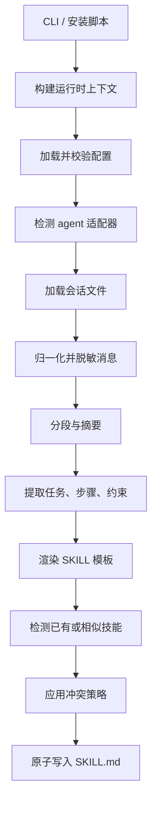

# 技术设计

> [English](TECHNICAL_DESIGN.md)

### 1. 架构目标

`Experience-to-Skill Generator` 的目标是把特定 OpenClaw 会话分析能力升级为通用 agent 技能生成能力。核心设计原则：

- **通用性**：不依赖单一 agent 的目录结构或命令。
- **可配置**：默认配置、配置文件、环境变量和 CLI 参数均可覆盖行为。
- **安全默认值**：默认脱敏，默认不保留原文，写入时避免破坏已有文件。
- **脚本友好**：所有核心命令输出 JSON 或稳定文本，错误返回非零退出码。
- **可扩展**：通过 adapter 和模板配置扩展新的 agent 与输出格式。

### 2. 数据流



### 3. Agent 适配策略

内置 adapter（字段需与 [universal_skill_generator.py](../python-scripts/universal_skill_generator.py) 中 `KNOWN_AGENT_ADAPTERS` 一致）：

| Adapter | `markers` | `skill_dir` | `config_dir` | `session_dir` | `metadata_format` |
| --- | --- | --- | --- | --- | --- |
| `openclaw` | `[".openclaw"]` | `~/.openclaw/skills` | `~/.openclaw/config/skills/experience-to-skill-generator` | `~/.openclaw/agents` | `openclaw` |
| `generic` | `[]` | `./generated_skills` | `./.experience-to-skill-generator` | `./sessions` | `generic` |

`auto` 策略会优先检测 OpenClaw 标记或 `openclaw` 命令；否则回退到 `generic`。无需手动指定。

可通过配置中的 `adapters` 扩展新 agent：

```json
{
  "adapters": {
    "custom-agent": {
      "skill_dir": "~/.custom-agent/skills",
      "config_dir": "~/.custom-agent/config/experience-to-skill-generator",
      "session_dir": "~/.custom-agent/sessions",
      "metadata_format": "generic"
    }
  }
}
```

### 4. 会话分析策略

当前实现采用轻量规则分析，不依赖外部模型：

- 从用户消息中提取包含"请、需要、帮我、实现、修复、分析、生成"等标记的任务句。
- 从 assistant 消息中提取编号列表、项目符号和步骤性句子。
- 从全文中提取"必须、禁止、注意、只能、避免"等约束句。
- 使用中英文词形规则提取关键词。
- 根据消息数量、任务、步骤、角色覆盖计算置信度。

当 `confidence` 低于配置中的 `analysis.confidence_threshold` 时，生成文档会提示需要人工审核。

### 5. 模板与元数据

支持的模板：

| 模板 | 说明 |
| --- | --- |
| `standard` | 默认模板，包含完整章节 |
| `compact` | 简洁模板，适合内部快速沉淀 |
| `checklist` | 清单模板，适合执行型流程 |

支持的 metadata 格式：

| 格式 | 行为 |
| --- | --- |
| `generic` | 使用 HTML 注释保存 JSON metadata |
| `openclaw` | 使用 YAML-like front matter 保存 metadata |
| `json` | 输出 JSON metadata 块 |

### 6. 写入与冲突处理

写入流程：

1. 解析目标目录。
2. 检查同名 `SKILL.md`。
3. 检查相似技能目录名，默认相似阈值为 `0.8`。
4. 应用冲突策略。
5. 写入临时文件。
6. 原子替换最终 `SKILL.md`。

冲突策略：

- `rename`：写入新目录。
- `skip`：返回已有路径，不写入。
- `overwrite`：先创建 `.bak` 备份。
- `merge`：追加新分析结果。
- `fail`：抛出用户可读错误并返回非零退出码。

### 7. 安装脚本设计

`skills/experience-to-skill-generator/install.sh` 负责：

- 检查 Python 3.8+。
- 检查可选依赖 `numpy`、`sklearn`。
- 自动识别 OpenClaw 或通用兼容安装策略。
- 复制技能包和配置文件。
- 在 `ESG_BIN_DIR` 下创建 `experience-to-skill-generator` 命令入口。
- 可选执行 `openclaw skills install/update`。
- 创建示例会话数据。
- 安装失败时清理本次创建的临时文件。

#### 7.1 命令入口脚本原理

安装脚本通过 Here Document 语法生成一个 **Shell 包装脚本**（非二进制编译），作为 CLI 命令入口：

```bash
cat > "$cli_path" <<EOF
#!/usr/bin/env bash
export ESG_LANG="${CLI_LANG}"
exec "$PYTHON_BIN" "$PROJECT_DIR/python-scripts/universal_skill_generator.py" "\$@"
EOF
chmod +x "$cli_path"
```

核心要点：

| 要素 | 说明 |
| --- | --- |
| `cat > ... <<EOF` | Shell Here Document 语法，将多行文本写入目标文件 |
| `#!/usr/bin/env bash` | Shebang，声明用 bash 执行该脚本 |
| `export ESG_LANG="..."` | 将安装时选择的语言写入脚本，CLI 帮助文本自动按此语言显示，用户无需手动设置环境变量 |
| `exec` | 用 Python 进程**替换**当前 Shell 进程，避免多余的父进程开销 |
| `"$PYTHON_BIN"` / `"$PROJECT_DIR/..."` | 安装时展开为实际绝对路径，写死到脚本中 |
| `"\$@"` | `$` 被转义，写入后变成 `"$@"`，运行时透传所有用户参数 |
| `chmod +x` | 赋予可执行权限 |

最终生成的文件内容示例：

```bash
#!/usr/bin/env bash
exec "/usr/bin/python3" "/home/user/experience-to-skill-generator/python-scripts/universal_skill_generator.py" "$@"
```

这种方式的特点：

- **不是**编译打包（区别于 PyInstaller 等工具），无需编译步骤。
- **是**一个薄 Shell 脚本充当"快捷方式"，修改 `.py` 源码后立即生效。
- 运行时依赖系统已安装的 Python 解释器。

### 8. 验证策略

- **单元测试**：`python3 -m unittest python-scripts/test_universal_skill_generator.py`
- **端到端验证**：`python3 python-scripts/e2e_validate_universal_skill_generator.py`
- **编译检查**：`python3 -m py_compile python-scripts/universal_skill_generator.py`

端到端验证覆盖：

- `generic` agent 流程。
- `openclaw` agent 流程。
- `diagnose`、`analyze`、`generate` 命令。
- 生成文档必要章节与 metadata。

### 9. 代码模块布局

`python-scripts/` 目录仅包含 3 个文件：

| 文件 | 职责 |
| --- | --- |
| `universal_skill_generator.py` | 主 CLI 入口；实现全部 5 个子命令（`analyze` / `generate` / `diagnose` / `config` / `validate-config`）、配置合并、adapter 检测、会话分析、模板渲染与原子写入 |
| `test_universal_skill_generator.py` | 主 CLI 单元测试 |
| `e2e_validate_universal_skill_generator.py` | 覆盖 `generic` 与 `openclaw` 两种 adapter 流程的端到端验证 |