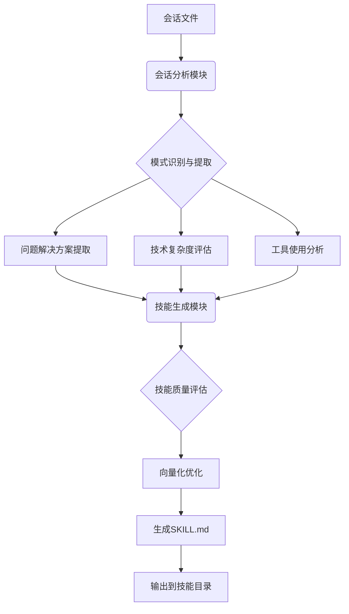

# Experience-to-Skill Generator

将 OpenClaw 会话历史自动转化为可复用的技能，用于知识沉淀和商业化技能开发。基于 AI 分析的会话模式识别和技能模板生成能力，帮助企业或个人从历史工作对话中提取有价值的技术知识和最佳实践。

## 使用场景

1. **企业知识管理** - 将团队内部的技术讨论转化为标准技能文档，避免经验流失
2. **开发者工具链** - 个性化技能生成，基于开发者自身的编程习惯和工作流程
3. **商业化技能开发** - 识别高价值技能机会，快速生成可售卖的 SaaS 技能
4. **技能质量评估** - 量化技能的技术深度、商业价值和工程可用性
5. **批量技能处理** - 分析大量会话历史，快速生成技能库

## 技术特性

### 核心算法
- **余弦相似度匹配** - 向量化语义识别（numpy 可选，支持纯 Python 降级）
- **多层会话分析** - 原始对话解析 + 模式识别 + 复杂度评估
- **技能质量评估** - 基于 12 个技术维度的综合量化评分
- **向量数据库优化** - 支持 numpy 加速和纯 Python 两种实现
- **技能模板引擎** - 可定制的技能文档生成系统

## 执行流程



### 具体操作步骤

1. **会话数据准备** - 准备 JSON/JSONL/Markdown 格式的会话历史文件
2. **运行诊断** - 执行 `experience-to-skill-generator diagnose` 检查环境
3. **分析会话** - 执行 `experience-to-skill-generator analyze` 提取有价值内容
4. **生成技能** - 执行 `experience-to-skill-generator generate` 生成标准 SKILL.md
5. **质量优化** - 使用向量优化器优化技能质量
6. **持续改进** - 基于使用反馈更新和完善技能

### 快速开始命令

```bash
# 1. 诊断环境
experience-to-skill-generator diagnose --input ./sessions

# 2. 分析会话
experience-to-skill-generator analyze --input ./sessions/example.json

# 3. 生成技能
experience-to-skill-generator generate --input ./sessions/example.json --output-dir ./generated_skills

# 4. 一键生成（分析+生成）
experience-to-skill-generator universal-generate --input ./sessions --output-dir ./generated_skills

# 5. 查看配置
experience-to-skill-generator config
```

## 工具支持

本技能提供以下工具：

### `分析会话历史（analyze_session）`
分析会话历史文件，提取有价值的技术经验和技能模式。

**参数：**
- `session_path` - 会话文件路径或目录路径（必填）
- `min_score` - 最低质量评分阈值（默认50）
- `output_format` - 输出格式：json/markdown/skill（默认json）

### `生成技能文档（generate_skill）`
基于分析结果生成标准的 SKILL.md 文档。

**参数：**
- `analysis_data` - 会话分析结果，JSON 格式（必填）
- `template_name` - 使用的技能模板名称（默认standard）
- `output_dir` - 输出目录路径（默认generated_skills/）

### `批量技能生成（batch_generate）`
批量处理多个会话历史，自动生成技能库。

**参数：**
- `input_dir` - 输入会话目录路径（必填）
- `output_dir` - 输出技能目录路径（默认skill_library/）
- `batch_size` - 批量处理大小（默认10）
- `concurrent` - 并发处理数（默认2）

### `技能质量评估（assess_skill）`
评估技能文档的质量，给出改进建议。

**参数：**
- `skill_path` - 技能文件路径（必填）
- `assessment_dimensions` - 评估维度数组（可选，默认全维度）

### `向量化技能搜索（vector_search）`
在技能库中基于语义相似度搜索相关技能。

**参数：**
- `query` - 搜索查询词（必填）
- `skills_dir` - 技能库目录路径（默认skills/）
- `limit` - 返回结果数量（默认5）

### `通用技能生成（universal_generate）**
在 OpenClaw 或通用 agent 环境中读取会话并生成结构化 SKILL。

**参数：**
- `session_path` - 会话文件或目录路径（必填）
- `output_dir` - 生成 SKILL 的输出目录（默认generated_skills/）
- `agent` - agent 类型：auto/openclaw/generic（默认auto）
- `conflict_strategy` - 同名 SKILL 冲突处理策略（默认rename）
- `skill_name` - 可选的生成 SKILL 名称

## 最佳实践

### 企业应用场景

1. **技术团队知识沉淀** - 将代码审查、技术讨论转为技能
2. **开发者个人工具箱** - 自动记录常用命令和脚本
3. **商业化技能产品开发** - 发现高价值技能机会，快速原型化

### 质量保证策略

1. **技能评分体系** - 技术深度、商业价值、工程可用性多维评分
2. **验证流程** - 人工 review 高价值技能 + 实际使用测试
3. **持续改进** - 基于使用数据优化算法，技能模板动态调整

## 配置选项

### 环境变量配置

```bash
# 技能质量阈值
export ESG_MIN_SCORE=55
export ESG_HIGH_VALUE_THRESHOLD=75

# 向量算法配置
export ESG_SIMILARITY_THRESHOLD=0.8

# 输出配置
export ESG_OUTPUT_DIR=./generated_skills
export ESG_SESSION_DIR=./sessions

# 安装策略
export ESG_AGENT=auto           # auto|openclaw|generic
export ESG_NON_INTERACTIVE=1    # 非交互模式
```

## 注意事项

### 技术限制
1. **依赖关系** - numpy 为可选依赖，核心功能支持纯 Python 运行
2. **算法精度** - 向量相似度基于关键词特征匹配，实际精度取决于会话内容质量
3. **会话格式** - 支持 JSON、JSONL、Markdown 等多种会话格式

### 安全建议
1. **输入验证** - 对会话文件进行安全性检查
2. **输出审核** - 生成技能前评估内容安全性
3. **隐私保护** - 处理企业敏感信息时需注意数据脱敏

---

本技能由 Experience-to-Skill Generator 项目生成，适合技术团队、开发者个人和商业化技能开发者使用。
